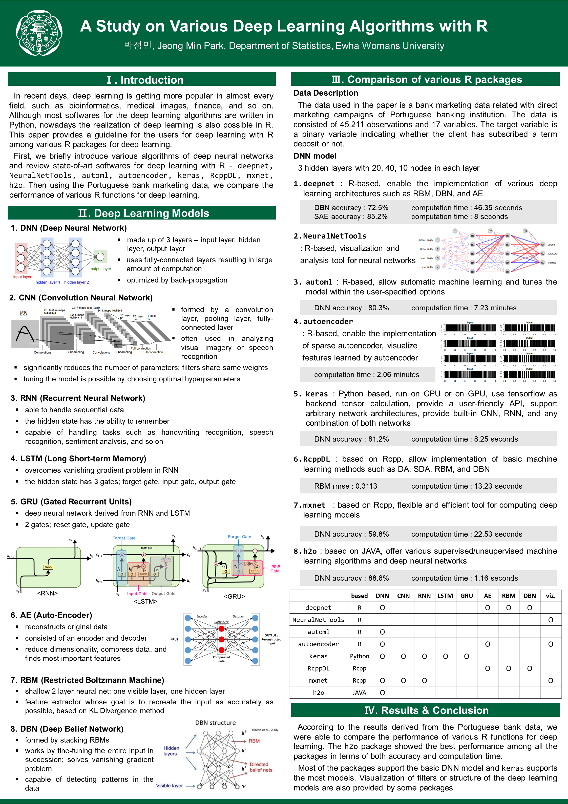

## 석사학위 청구논문 
### A Study on Various Deep Learning Algorithms with R
#### 이화여자대학교 대학원 통계학과 박정민 (2020.2)

[원문보기](http://lib.ewha.ac.kr/search/media/url/CAT000002035501)

 
* 국문초록
  + 오늘날 딥러닝은 생물정보학, 의료영상학, 금융공학, 컴퓨터 과학 등 거의 모든 분야에서 각광받고 있다. 대부분의 딥러닝 알고리즘은 Python으로 짜여져 있는데 이는 백엔드 텐서 계산방식이 Tensorflow를 기반으로 하기 때문이다. 그렇지만 최근 들어서는 통계 분야에서 더 활발하게 사용되는 R에서도 딥러닝의 구현이 가능하게 되었다. 이 논문에서는 R에서 사용할 수 있는 다양한 딥러닝 패키지를 소개하고 각 패키지의 사용법에 대한 가이드라인을 제공한다. 먼저, 딥러닝의 다양한 알고리즘을 간단히 소개하고 딥러닝 학습을 위한 최첨단 소프트웨어를 검토한다. 본 논문에서 소개할 R 패키지는 다음과 같다 – deepnet, NeuralNetTools, automl, autoencoder, keras, RcppDL, mxnet, h2o. 또한, 사용자들이 각 패키지의 기능을 쉽게 이해할 수 있도록 샘플코드를 제공하고 포르투갈의 은행 데이터를 활용하여 다양한 R 함수의 성능을 각각 비교하는 것으로 논문을 마무리한다.
